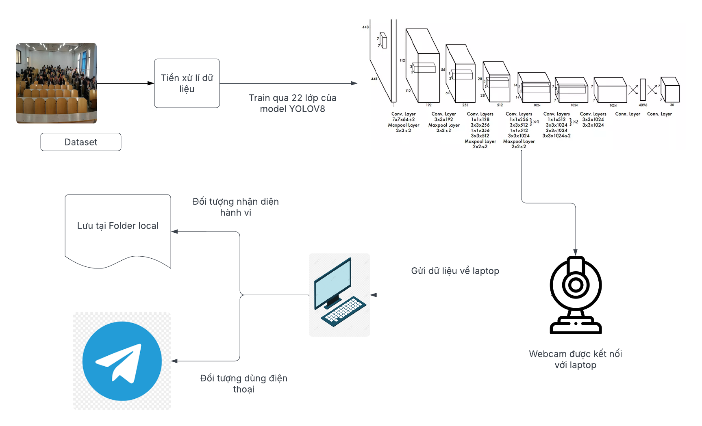
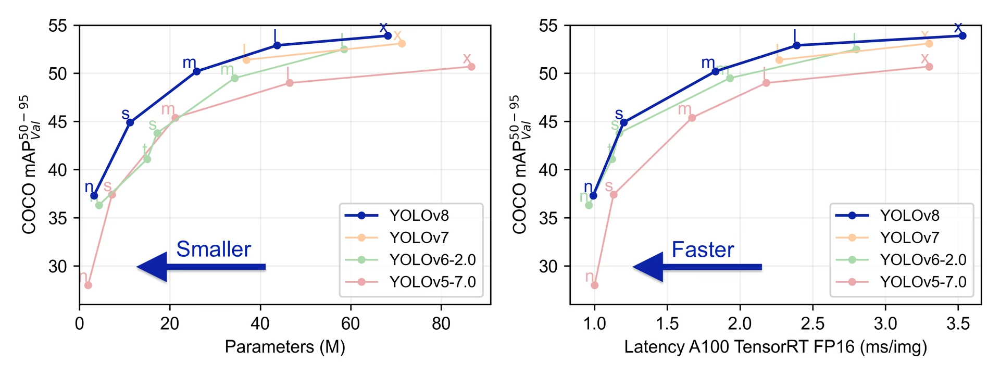

<h1 align="center">NHẬN DIỆN HÀNH VI CỦA SINH VIÊN TRONG LỚP HỌC </h1>

<div align="center">

<p align="center">
  
    
</p>

[](https://www.facebook.com/DNUAIoTLab)
[](https://fitdnu.net/)
[](https://dainam.edu.vn)
</div>

<h2 align="center">Sử Dụng Yolov8 Để Nhận Diện Hành Vi Của Sinh Viên</h2>

<p align="left">
  Nhận diện hành vi học sinh trong lớp học sử dụng YOLOv8 là ứng dụng công nghệ AI để phát hiện hành vi như giơ tay, sử dụng điện thoại. YOLOv8 giúp nhận diện đối tượng trong ảnh/video theo thời gian thực, hỗ trợ giáo viên quản lý lớp học hiệu quả hơn. Công nghệ này giúp tăng cường sự tương tác và giám sát, nâng cao chất lượng dạy và học.
  Đề tài này sử dụng model YOLOV8 để nhận diện hành vi học sinh với các hành vi như giơ tay, cúi đầu, sử dụng điện thoại/máy tính. YOLOV8 nổi tiếng với chức năng phát hiện đối tượng và phân loại cùng lúc theo thời gian thực, giúp giáo viên quản lý lớp học hiệu quả hơn. Bọn em chọn công nghẹ này để 


</p>

---

## 🌟 Giới thiệu
<p align="center">
  
</p>

---
## 🏗️ HỆ THỐNG
<p align="center">
  
</p>

---


## 🛠️ CÔNG NGHỆ SỬ DỤNG

<div align="center">

<p align="center">
  
</p>
</div>

##  Yêu cầu hệ thống

-Có thể sử dụng Visual Studio Code nếu máy có GPU đủ mạnh
<br>
  hoặc là
<br>
-Sử dụng <a href="https://colab.google/" target="_blank">Google Colab</a> hỗ trợ cho dùng miễn phí GPU để train model.

## 🚀 Hướng dẫn cài đặt và chạy


## 🚀 Hướng dẫn cài đặt và chạy mô hình YOLOv8

### Bước 1: Thu thập dữ liệu
Sử dụng dataset đã được gán nhãn sẵn tại môi trường Trường Đại học Đại Nam:

[👉 Link Dataset](https://universe.roboflow.com/ttnt-nyz2m/ai-fxy4m/dataset/2)

### Bước 2: Sử dụng Google Colab để Train mô hình
Truy cập vào Google Colab để thực hiện huấn luyện mô hình YOLOv8.

*Lưu ý: Nên sử dụng Colab Pro để huấn luyện mô hình nặng hơn.*

```python
from google.colab import drive
drive.mount('/content/drive')
```

### Bước 3: Cài đặt các thư viện cần thiết
Cài đặt thư viện và Ultralytics bằng câu lệnh sau:

```bash
!pip install ultralytics
```

### Bước 4: Huấn luyện mô hình
Sử dụng lệnh dưới đây để huấn luyện mô hình YOLOv8:

```bash
!python /content/yolov8/train.py \
    --data "/content/drive/MyDrive/BTL_AII/AI.v3-ai.yolov8pytorch/data.yaml" \
    --cfg "/content/yolov8/cfg/training/yolov8.yaml" \
    --weights "/content/SCB-dataset/yolov8/yolov8.pt" \
    --epochs 50 \
    --batch-size 16 \
    --img-size 640 \
    --device 0 \
    --workers 4 \
    --cache-images \
    --name Yolo7_BTL \
    --project "/content/drive/MyDrive/BTL_AII"
```
*Lưu ý: Chỉnh lại các tham số batch-size, workers phù hợp với cấu hình GPU.*

### Bước 5: Nhận diện hành vi qua video
Download best.pt từ file weights của file kết quả train, rồi tạo file python để
chạy mô hình YOLOv8 để nhận diện hành vi trong video sử dụng webcam laptop với đoạn mã sau:

```python

import cv2
import os
import time
from ultralytics import YOLO

# Load your custom YOLOv8 model
model = YOLO('D:/aiot/models/best (2).pt')  # Replace with the correct path to your model

# Create the 'detected_frames' directory if it doesn't exist
output_folder = 'detected_frames/final'
if not os.path.exists(output_folder):
    os.makedirs(output_folder)

# Open webcam (or video stream if needed)
cap = cv2.VideoCapture(0)  # Use 0 for default webcam, or provide the video stream path

if not cap.isOpened():
    print("Error: Could not open webcam.")
    exit()

frame_count = 0  # Counter for naming saved frames
last_save_time = 0  # Thời điểm lưu ảnh cuối cùng

while True:
    ret, frame = cap.read()

    if not ret:
        print("Error: Could not read frame from webcam.")
        break

    # Perform object detection on the frame
    results = model(frame)

    # Kiểm tra nếu có phát hiện đối tượng
    if len(results) > 0:  # Đảm bảo results không rỗng
        result = results[0]  # Lấy đối tượng Results đầu tiên
        if len(result.boxes) > 0:  # Kiểm tra nếu có đối tượng được phát hiện
            # Render results (bounding boxes, labels, etc.)
            annotated_frame = result.plot()  # plot() trả về frame đã được vẽ

            # Lưu ảnh nếu đã qua 1 giây kể từ lần lưu trước
            current_time = time.time()
            if current_time - last_save_time >= 1:  # Kiểm tra thời gian
                frame_filename = os.path.join(output_folder, f'frame_{frame_count:04d}.jpg')
                cv2.imwrite(frame_filename, annotated_frame)  # Save the frame as an image
                print(f"Đã lưu ảnh: {frame_filename}")
                last_save_time = current_time  # Cập nhật thời gian lưu cuối cùng
                frame_count += 1
        else:
            # Nếu không có đối tượng, dùng frame gốc để hiển thị
            annotated_frame = frame
    else:
        # Nếu không có kết quả, dùng frame gốc
        annotated_frame = frame

    # Display the annotated frame
    cv2.imshow('Live Stream Object Detection', annotated_frame)

    # Exit loop when 'q' is pressed
    if cv2.waitKey(1) & 0xFF == ord('q'):
        break

# Release video capture and close window
cap.release()
cv2.destroyAllWindows()
```
Sau đó các frame nhận diện được bởi mô hình sẽ được lưu vào folder detected_frames


## 🤝 Đóng góp
Dự án được phát triển bởi 3 thành viên:

| Họ và Tên                | Vai trò                  |
|--------------------------|--------------------------|
| Võ Vĩnh Thái             | Phát triển toàn bộ mã nguồn,kiểm thử, triển khai dự án, thuyết trình, đề xuất cải tiến.|
| Lê Ngọc Hưng            | Thực hiện video giới thiệu|
| Phạm Tiến Dũng   | Viết báo cáo.  |

© 2025 NHÓM 2, CNTT 16-01, TRƯỜNG ĐẠI HỌC ĐẠI NAM
